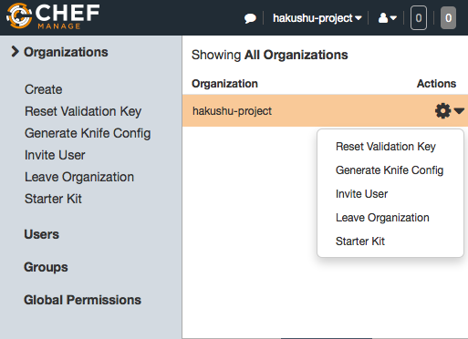
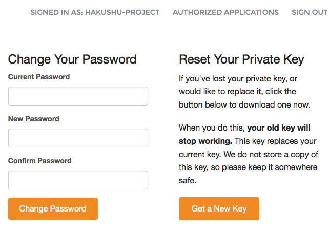
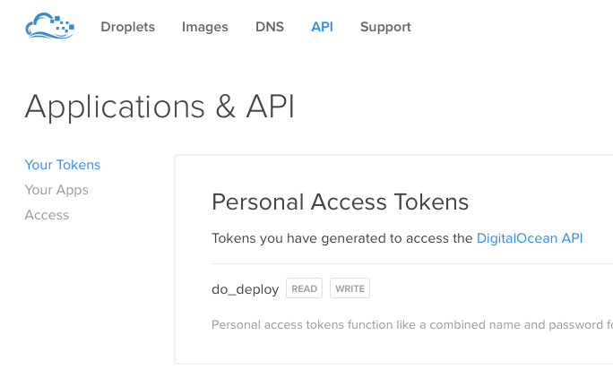

## Hakushu.io

### Server install script: Chef + Digital Ocean + Debian 8

Based on MacOS

### Requirements

- 1

```
sudo chown -R $USER /usr/local
brew doctor
```

- 2

existed `id_rsa` which placed in `~/.ssh`

- 3

Make sure

```sh
ssh-add ~/.ssh/id_rsa && ssh-add -L

ssh-add -l
```

### Install RVM

```sh
gpg --keyserver hkp://keys.gnupg.net --recv-keys 409B6B1796C275462A1703113804BB82D39DC0E3
\curl -sSL https://get.rvm.io | bash -s stable
source ~/.profile
rvm -v
```

### Prepare file structure

```sh
mkdir -p ~/rails/hakushu_pub
cd ~/rails/hakushu_pub
```

### Clone Chef installer

```
git clone git@github.com:hakushu-publishing/chef-do-debian8.git
cd chef-do-debian8/
```

### Create folder for Chef config files

```sh
mkdir -p .chef
```

### Install required Ruby version

```sh
rvm install ruby-2.2-head
```

```sh
cd .

rvm list        # >> ruby-2.2-head
rvm gemset name # >> chef
```

### Install Chef DK

https://downloads.chef.io/chef-dk/mac/

```sh
chef -v

  Chef Development Kit Version: 0.9.0
  chef-client version: 12.5.1
  berks version: 4.0.1
  kitchen version: 1.4.2

chef verify
```

### Install GEMs

```sh
gem install bundle
bundle
```

### SIGNUP for Chef.io Account

https://manage.chef.io/signup

**Project Name:** hakushu-project

https://manage.chef.io/

**Organization Name:** Hakushu Project Org

**Organization Name (short):** hakushu-project

### Get config files from Chef.io Account



- Generate Knife Config

Download to `~/rails/hakushu_pub/chef-do-debian8/.chef`

- Reset validation key

Download to `~/rails/hakushu_pub/chef-do-debian8/.chef`

https://id.chef.io/id/signin

**Project Name:** hakushu-project



- Get a New Key

Download to `~/rails/hakushu_pub/chef-do-debian8/.chef`

```sh
cd ~/rails/hakushu_pub/chef-do-debian8/.chef
ls -al

> hakushu-project-validator.pem
> hakushu-project.pem
> knife.rb
```

### SIGNUP for DigitalOcean Account

- Generate API token



### Add DO API token to `knife.rb`

Add following line to `~/rails/hakushu_pub/chef-do-debian8/.chef/knife.rb`

```ruby
knife[:digital_ocean_access_token] = 'XXXXXXXXXXXXXXXXXXXXXX'
```

### CHECK Digital Ocean account

```sh
knife digital_ocean account info

UUID   Email              Droplet Limit  Email Verified
d03f0  example@email.com  10             true
```

also

```sh
knife digital_ocean image list -P
knife digital_ocean region list
knife digital_ocean size list
```

### Create and Upload to DO ssh key

```sh
knife digital_ocean sshkey create -n do_ssh_key -i ~/.ssh/id_rsa.pub
```

and check

```sh
knife digital_ocean sshkey list

> ID       Name        Fingerprint
> 1516632  do_ssh_key  51:cb:9a:f8:b1:35:52:b8:f5:c2:96:04:c1:b7:76:49
```

### Upload your recipes to Chef.io (chef-server)

```sh
librarian-chef update
knife cookbook upload --all
```

and check

https://manage.chef.io/organizations

### Create server and install Software

```sh
knife digital_ocean droplet create \
  --server-name hakushu.io \
  --image debian-8-x64 \
  --location ams3 \
  --size 512mb \
  --ssh-keys 1519548 \
  --run-list "recipe[hakushu_app]" \
  --bootstrap
```

You will see something like that

```sh
Droplet creation for hakushu.io started. Droplet-ID is 8215014
Waiting for IPv4-Address.done
IPv4 address is: 188.166.92.172
```

### Your server will be ready soon

Hurray!

---

### Additional commands

`knife status`

`knife digital_ocean droplet list`

**Destroy Droplet**

```sh
knife digital_ocean droplet list
knife digital_ocean droplet destroy -S 8177569

knife client list
knife client delete hakushu.io -y
```

**Re-run recipes**

```sh
(librarian-chef update) && \
(knife cookbook upload --all) && \
(knife ssh "name:hakushu.io" "chef-client -l info" -x root -G 188.166.70.248)
```

**Destroy ssh key**

```sh
knife digital_ocean sshkey list
knife digital_ocean sshkey destroy -i 1516629
```

**Create role**

```sh
knife role create hakushu_app
knife role list
```

## The MIT License (MIT)

Copyright (c) hakushu.io, 2015

Permission is hereby granted, free of charge, to any person obtaining a copy of this software and associated documentation files (the "Software"), to deal in the Software without restriction, including without limitation the rights to use, copy, modify, merge, publish, distribute, sublicense, and/or sell copies of the Software, and to permit persons to whom the Software is furnished to do so, subject to the following conditions:

The above copyright notice and this permission notice shall be included in all copies or substantial portions of the Software.

THE SOFTWARE IS PROVIDED "AS IS", WITHOUT WARRANTY OF ANY KIND, EXPRESS OR IMPLIED, INCLUDING BUT NOT LIMITED TO THE WARRANTIES OF MERCHANTABILITY, FITNESS FOR A PARTICULAR PURPOSE AND NONINFRINGEMENT. IN NO EVENT SHALL THE AUTHORS OR COPYRIGHT HOLDERS BE LIABLE FOR ANY CLAIM, DAMAGES OR OTHER LIABILITY, WHETHER IN AN ACTION OF CONTRACT, TORT OR OTHERWISE, ARISING FROM, OUT OF OR IN CONNECTION WITH THE SOFTWARE OR THE USE OR OTHER DEALINGS IN THE SOFTWARE.
